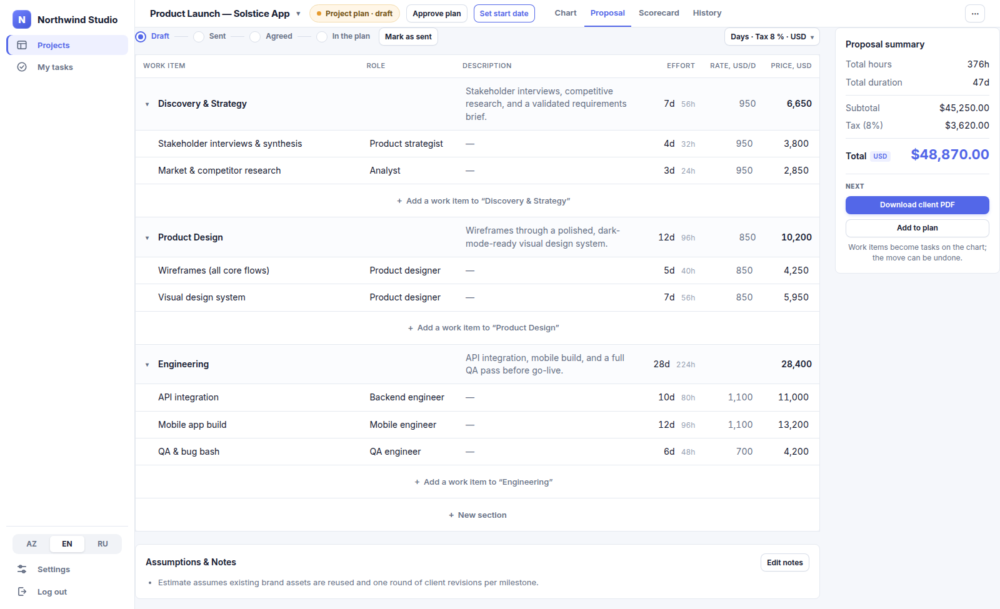

[Русская версия / deployment & ops guide →](README.ru.md)

# Planora

**A self-hosted project planner** for teams who plan work on a Gantt chart
and need to explain it to clients: organizations → projects → categories →
tasks, an undo-able edit journal instead of silent overwrites, a
proposal/quoting module that turns a plan into a priced estimate, and a
weekly health dashboard that flags what's slipping before a client asks.

No SaaS account, no per-seat billing — one `docker compose up` and it's
running on your own server, behind your own domain.


## Features

### Gantt-chart planning
Drag tasks across the timeline, draw dependencies between them, mark
milestones and criticality, and — if you turn on auto-scheduling for a
project — let dependent tasks cascade forward automatically when something
upstream slips. The chart is hand-built SVG — no charting library, no
license, no bundle bloat.

### Portfolio at a glance


The projects list *is* the status report: done/in-progress/blocked/overdue
counts per project, so "how's it going?" has an answer before you open
anything.

### Task cards built for collaboration


Every task carries its own description, status, criticality, dependencies,
assignees, and a threaded comment discussion — click a bar on the chart and
the whole conversation is right there.

### Nothing is ever silently lost


Every edit to the plan — move a task, add a dependency, rename a category —
is written to a revision journal with a computed inverse, so it can be
undone one click at a time. The History tab reads straight from that
journal: a full, attributed changelog of the plan, not just an audit log
nobody opens.

### Weekly health Scorecard


One screen, one question: who on the team is on pace this week. Three
project numbers up top (overdue, blocked, finish drift), then a row per
person — done out of planned, extra work, on-time count, an eight-week
trend, and, for the project owner only, a signal with its reason ("2 missed,
no warning", "blocked for 3 wd"). Assignees flag their own risk on a task
(🟢🟡🔴 with a one-line reason), and the scorecard tells "warned ahead"
from "missed silently" by the revision journal. Past weeks are frozen at
the moment they were recorded, so trends reflect reality, not this week's
recalculated targets.

### Turn the plan into a quote


Price out the same plan as a client proposal — role, effort, rate, tax —
and push the agreed line items straight into the Gantt chart as real tasks
once the client signs off, instead of re-typing the estimate a second time.

### Import and sync from Jira
Already tracking work in Jira? Connect an org's Jira Cloud/Server instance
with an API token, pick a project, and import its issues and epics straight
into a Gantt plan — issues become tasks, epics become categories, and the
whole import is one undo away like any other batch edit. Re-sync pulls
status/date updates from Jira on demand; a manual "push to Jira" sends a
task's due date the other way once you've adjusted it here.

### Share it outside the team


Issue a public, read-only link for a client or stakeholder — no account, no
invite, just the live chart. Revoke it and the link stops working
immediately.

## Quick start

Docker with the `compose` plugin is the only dependency — no Python or
Node.js needed on the host.

```sh
git clone https://github.com/aspacev1/planora.git
cd planora
cp .env.example .env      # set APP_SECRET, DIRECTOR_EMAIL, and Postgres credentials
docker compose up --build
```

The first run takes a few minutes to build the images and apply the schema;
after that, `docker compose up` starts in seconds. On a **fresh generic
clone** this opens on <http://localhost:8080> to register the first
account — it becomes the `owner` of its own organization.

> **Note:** the `docker-compose.yml`/`Caddyfile` currently committed to this
> repository are pre-configured for this installation's own production
> domain (fixed host ports `80`/`443`, Caddy matching one specific
> hostname) rather than the generic `WEB_PORT`/`localhost` template
> described above. If you're self-hosting your own copy, edit the site
> block in `Caddyfile` back to your domain (or `:8080` for plain HTTP) and
> the `web` service's `ports:` in `docker-compose.yml` accordingly — see
> the [full guide](README.ru.md)'s "Свой домен и TLS" section, which walks
> through exactly that edit.

That's the short version. For backups and restore, a custom domain and TLS,
transactional mail, invitations, deploying to Vercel, and the local dev
workflow, see the [full guide](README.ru.md) (in Russian).

## How it's built

- **Backend** — FastAPI + SQLAlchemy 2.0 + Alembic + Postgres (Python 3.12).
- **Frontend** — React 19 + TypeScript + Vite + TanStack Query.
- **One domain** — Caddy serves the frontend and proxies `/api/*` to the
  backend, so the session cookie stays HTTP-only and same-origin.
- **Two deploy targets** — self-hosted Docker with live WebSocket updates,
  or serverless on Vercel with an external Postgres.
- **Secrets encrypted at rest** — API credentials for the optional AI
  integration are stored Fernet-encrypted and never returned by the API.

## Documentation

- [README.ru.md](README.ru.md) — self-hosting, backups, mail, invitations,
  Vercel deploy, and the local dev workflow.
- [docs/](docs/) — design notes and architecture write-ups.
