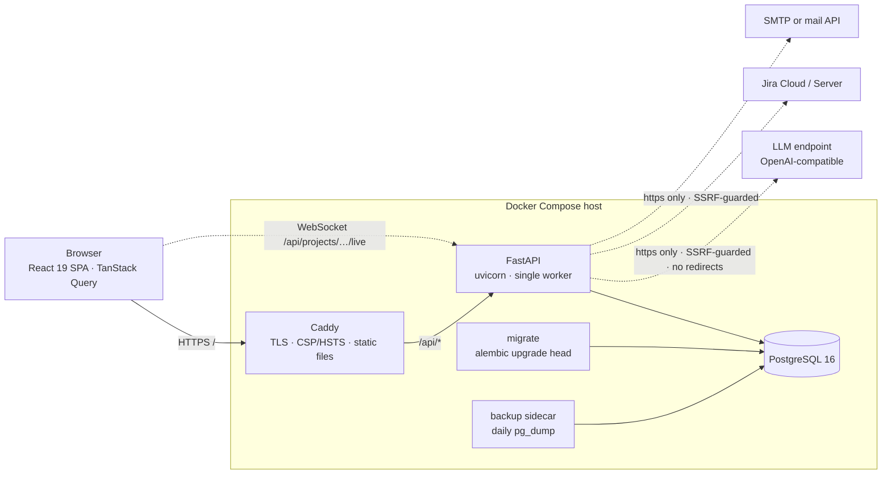

<p align="right"><a href="README.ru.md">Русская версия · руководство по развёртыванию и эксплуатации →</a></p>

<p align="center">
  <picture>
    <source media="(prefers-color-scheme: dark)" srcset="docs/brand/planora-logo-dark.svg">
    
  </picture>
</p>

<h3 align="center">Self-hosted project planning for teams that answer to clients.</h3>

<p align="center">
  Gantt-chart planning with an undo-able revision journal, approved baselines,<br>
  client-facing proposals, a weekly team health scorecard, and AI-assisted project intake —<br>
  on your own infrastructure, behind your own domain, with no per-seat billing.
</p>

<p align="center">
  <a href="https://github.com/aspacev1/planora/actions/workflows/ci.yml"></a>
  
  
  
  
  
  
  
  <a href="LICENSE"></a>
</p>

<p align="center">
  <a href="#quick-start">Quick start</a> ·
  <a href="#capabilities">Capabilities</a> ·
  <a href="#architecture">Architecture</a> ·
  <a href="#security">Security</a> ·
  <a href="#roles-and-permissions">Roles</a> ·
  <a href="#deployment">Deployment</a> ·
  <a href="#api">API</a> ·
  <a href="#development">Development</a> ·
  <a href="#documentation">Documentation</a> ·
  <a href="#license">License</a>
</p>

<br>

<p align="center">
  
</p>

---

## Overview

Planora is a multi-tenant project planner built for agencies, integrators, and delivery
teams whose plans are commitments to someone outside the team. It keeps the whole
lifecycle of a plan in one place:

1. **Scope it** — through a structured AI interview, a Jira import, or by hand.
2. **Price it** — a proposal module turns the plan into a quote and, once agreed, into real tasks.
3. **Commit to it** — approve a baseline; later slips must be explained, not hidden.
4. **Run it** — drag-and-drop Gantt editing, dependencies, critical path, live multi-user updates.
5. **Prove it** — every edit is journaled with an inverse, so history is complete and any change is one click from undone.
6. **Report it** — a weekly scorecard shows who is on pace, and a public read-only link keeps clients informed without an account.

The whole system is a single Docker Compose stack: Caddy, a FastAPI backend, PostgreSQL,
and a backup sidecar. No message broker, no Redis, no external SaaS dependency.

### At a glance

| | |
|---|---|
| **Tenancy** | Organizations own projects; users belong to any number of organizations with a role in each. |
| **Roles** | Owner · Editor · Viewer · Client, plus anonymous guests on public links. An install-wide *Director* role backs the admin panel. |
| **Planning model** | Project → Category → Task, with dependencies, milestones, criticality, progress, assignees, risk flags, and internal notes. |
| **Time model** | Relative plans ("Week 1 / Day 3") before a start date is set; calendar plans with working-day masks and holidays once it is. |
| **Change control** | Revision journal with computed inverses; approved plan baselines with a per-project shift threshold that requires a reason for larger slips. |
| **Integrations** | Any OpenAI-compatible LLM endpoint (bring your own key), Jira Cloud / Server, SMTP or HTTP mail APIs. |
| **Exports** | Excel workbook, PDF project document with a vector Gantt, client-facing proposal PDF. |
| **Localization** | Azerbaijani, English, Russian — UI and generated documents. |
| **Deployment** | Docker Compose (primary, with WebSocket live updates) or Vercel serverless with an external Postgres. |

---

## Capabilities

### Gantt planning without a charting library

The chart is hand-built SVG and React — no third-party Gantt component, no license, no
bundle bloat. Everything that changes dates is done directly on the timeline:

- **Direct manipulation** — drag bars to move, drag edges to resize, drag the fill to set
  progress, drag from a bar's handle to draw a dependency, drag categories to move a whole
  phase, and reorder rows with a handle. Every gesture has a keyboard equivalent.
- **Two time modes** — a project starts as a *relative* plan (Month 1 / Week 1 / Day 1) and
  converts to real dates the moment a start date is assigned, re-laid on the project's
  working calendar with weekends and holidays.
- **Working calendars** — working-day mask, extra holidays and extra workdays, and time
  zone are set per organization and overridable per project. End dates are always computed
  server-side from start + duration + calendar, so the browser and the database never disagree.
- **Milestones and criticality** — diamond milestones with zero span; four criticality
  levels; four statuses (planned, in progress, done, blocked).
- **Dependencies as a picture, or as a schedule** — by default a dependency is a drawn
  constraint and a violation is only *suggested* to be fixed. Turn on **auto-scheduling**
  per project and the server cascades successors forward (never backward, so intentional
  slack is preserved). A whole cascade is one journal entry and one undo.
- **Critical path** — computed on the server using total float in working days, rendered as
  a highlighted chain in the *View* menu.
- **Inline task creation** — type a name, press Enter, keep typing. Insert between rows
  with a single operation.

### Nothing is ever silently lost

<p align="center"></p>

Every plan edit — move, resize, rename, reassign, dependency, category, import batch — goes
through a single mutation engine that records the operation **and its computed inverse**.
The History tab reads straight from that journal, attributed and timestamped, and any
revision or batch can be undone with one click. A GIN-indexed JSONB journal makes per-task
history a query, not a reconstruction.

### Approved baselines and explained slips

Approving a plan freezes a numbered **plan version**: a snapshot of every task's start and
duration. From then on, each task carries its baseline, and any move or resize that
deviates from it by more than the project's **shift threshold** (default 2 days, set per
organization, overridable per project) requires a stated reason. Deviation is always
measured against the baseline, not the previous value, so five one-day nudges cannot add
up to an unexplained week. Previous versions are kept and can be restored.

### Task cards built for collaboration

<p align="center"></p>

Each task has a description, status, criticality, dependencies, assignees, progress, a
threaded comment discussion, and an **internal note** that clients and public guests never
see (stripped from API responses, exports, and the journal alike). Assignees flag their
own delivery risk (🟢 🟡 🔴 with a one-line reason), and the flag is journaled so the
scorecard can tell "warned ahead" from "missed silently". A cross-project **My tasks** view
lists everything assigned to you, sorted by what is due next.

### Portfolio at a glance

<p align="center"></p>

The project list *is* the status report: done / in progress / blocked / overdue counts per
project, so "how is it going?" has an answer before anything is opened.

### Weekly team health scorecard

<p align="center"></p>

One screen, one question: who is on pace this week. Three project-level numbers (overdue,
blocked, finish drift), then one row per person — done out of planned, unplanned extra
work, on-time count, an eight-week trend sparkline — and, visible to the owner only, an
assessment signal with its reason ("2 missed, no warning", "blocked for 3 working days").
Weekly snapshots are immutable once the week closes, so trends reflect what was true at
the time, not this week's recalculated targets. Metrics have configurable owners, targets,
and directions, and every number drills down to the tasks behind it.

### Proposals: from plan to quote and back

<p align="center"></p>

Price the same plan as a client proposal — role, effort (days or hours), rate, tax, with
decimal-safe money arithmetic — through draft → sent → agreed stages. **Build from plan**
seeds the estimate from the Gantt; **push to plan** turns agreed line items into real tasks
as one undo-able batch, and each line remembers its task so nothing is created twice.
Proposal line items have their own comment threads, and the whole proposal exports as a
client-ready PDF.

### AI-assisted project intake

Connect an organization to any OpenAI-compatible chat endpoint — a hosted provider or a
self-hosted model (llama.cpp, vLLM) — with your own key. The intake flow is a fixed
pipeline: **interview → summary → draft → apply**. The model asks structured questions
covering configurable required topics (goal, scope, deadline, people, constraints, what is
done, what is out of scope), produces a summary you can edit, drafts categories and tasks
you can edit, and writes to the project **only when a human clicks apply** — as one
journaled batch. A per-task *split into subtasks* action follows the same propose-then-apply
rule. Usage is metered per organization with a per-minute request cap and a daily token
budget; a model failure never loses the conversation.

### Jira import and sync

Connect a Jira Cloud or Server instance with an API token, pick a project, and import its
issues and epics into a plan: issues become tasks, epics become categories, and the whole
import is one undo away like any other batch. Re-sync pulls status and date updates on
demand; a manual push sends an adjusted due date back to Jira. Links between Jira entities
and plan entities are persisted so repeated syncs update rather than duplicate.

### Live collaboration

On the Docker deployment, every project has a WebSocket channel: revisions applied by one
user appear on everyone else's chart immediately, with lag detection that tells a stale
client to reload rather than replay. On serverless deployments the feature switches itself
off and the UI degrades gracefully.

### Exports and public sharing

<p align="center"></p>

- **Excel workbook** and **PDF document** (with a vector-drawn Gantt, history and comment
  excerpts) are generated from one localized, permission-trimmed snapshot so both formats
  always agree. Documents carry a configurable validity date.
- **Public read-only links** — `https://your-domain/p/<org>/<project>?s=<token>` — need no
  account. Guests see the live chart without internal notes or assignees, can comment
  (optionally, rate-limited, signed as "guest"), and can download the same exports. Rotate
  the token and the old link dies instantly; sharing can also be disabled install-wide or
  per organization.

### Organizations, members, and onboarding

- Users can belong to several organizations and switch between them.
- Invitations are single-use, expire, carry a role, and can be **project-scoped** so an
  editor or viewer sees only the projects they were invited to. Clients are always scoped.
- Email verification, password reset, and "sign out everywhere" flows. Signup can be
  `open`, `invite_only`, or `closed`.
- Mail is delivered over SMTP or an HTTP mail API (Resend-style); with no mail transport the
  product remains fully usable via copyable links.
- A **Director** (set by `DIRECTOR_EMAIL`) has an install-wide admin panel listing every
  account across organizations.

---

## Quick start

Docker with the Compose plugin is the only host dependency. No Python or Node.js needed.

```sh
git clone https://github.com/aspacev1/planora.git
cd planora
cp .env.example .env      # set APP_SECRET, DIRECTOR_EMAIL, and the Postgres credentials
docker compose up --build
```

The first run builds the images and applies the schema (a one-shot `migrate` service
runs Alembic before the API starts). On a generic clone the app is served on
<http://localhost:8080>. Register the first account: it becomes the owner of its own
organization.

> [!IMPORTANT]
> The committed `Caddyfile` and `docker-compose.yml` are pre-configured for this
> installation's own production hostname rather than the generic `localhost`/`WEB_PORT`
> template. When self-hosting your own copy, change the site block in `Caddyfile` to your
> domain (or `:8080` for plain HTTP) and the `web` service's `ports:` accordingly. The
> [Russian operations guide](README.ru.md#свой-домен-и-tls) walks through that exact edit.

What you get from `docker compose up`:

| Service | Image | Purpose |
|---|---|---|
| `web` | Caddy 2 (multi-stage build, static files only) | TLS, security headers, serves the SPA, proxies `/api/*` |
| `api` | Python 3.12 slim, non-root | FastAPI application, single worker (in-process live hub) |
| `migrate` | same as `api` | Runs `alembic upgrade head` once, then exits |
| `db` | PostgreSQL 16 (digest-pinned) | Primary datastore, health-checked |
| `backup` | PostgreSQL 16 client | Daily `pg_dump` in custom format to `./backups`, 14-day retention |

All containers run with `cap_drop: [ALL]`, `no-new-privileges`, memory limits, and pinned
base-image digests.

---

## Architecture



### Stack

| Layer | Technology |
|---|---|
| Backend | Python 3.12 · FastAPI · SQLAlchemy 2.0 (`Mapped[]`) · Alembic · psycopg 3 · Pydantic v2 · argon2 · cryptography (Fernet) · openpyxl · reportlab · dependency management with `uv` |
| Frontend | React 19 · TypeScript · Vite · TanStack Query · react-router v7 · Inter (self-hosted) · Vitest + Testing Library + MSW |
| Data | PostgreSQL 16 · JSONB journal with GIN index · check constraints derived from the same enums the code uses |
| Edge | Caddy 2 (Docker) or Vercel rewrites (serverless) |

### Design principles the codebase enforces

- **One domain, one cookie.** The SPA and `/api/*` are always served from the same origin,
  so the session cookie stays HTTP-only and same-site, and no CORS configuration exists.
- **Every plan edit is a journaled mutation.** Routes never `UPDATE` plan tables directly.
  A mutation returns the applied op and its inverse; both are persisted with a batch id.
  Proposals, comments, and scorecard snapshots deliberately live outside this journal.
- **Permissions are a literal matrix.** `Role → frozenset[Action]` in one file. A new
  capability forces an explicit decision for every role rather than inheriting one.
- **Invariants live in the database too.** Each `StrEnum` feeds a `CheckConstraint`, so the
  enum and the schema cannot drift apart. Migrations are hand-written, linear, and tested
  for both upgrade and downgrade against the ORM metadata.
- **Fail at startup, not at first use.** Configuration is validated with Pydantic before the
  first request: a missing secret, an unknown signup mode, an incomplete mail transport,
  or a multi-worker launch that would break the live hub all refuse to boot.
- **The server has no prose.** API errors are stable machine codes; the frontend maps them
  to localized messages. The OpenAPI schema is committed and the TypeScript client types
  are generated from it, with CI failing on drift.
- **Third-party integrations follow one template.** Encrypted credential at rest, boolean
  "configured" flag over the API (the secret is never returned), an SSRF guard on any
  user-supplied URL, a `Protocol`-typed client so tests run on recorded responses with no
  network.

---

## Security

| Area | Implementation |
|---|---|
| Passwords | argon2id hashing; constant-time login path so response timing cannot reveal whether an address is registered |
| Sessions | HTTP-only, same-site cookie; 30-day lifetime with a 7-day idle timeout; only token hashes are stored; "close other sessions" endpoint |
| One-time tokens | Invitations, email verification, and password resets store SHA-256 hashes and reveal the raw token exactly once |
| CSRF | `SameSite` cookie plus an `Origin`/`Referer` host check on every writing request as a second line of defense |
| Secrets at rest | LLM keys and Jira tokens are Fernet-encrypted with a key derived from `APP_SECRET`, never returned by the API |
| SSRF | Outbound calls to user-supplied URLs (LLM endpoint, Jira base URL) require HTTPS, must resolve only to public IP addresses, and never follow redirects; a documented opt-out exists for self-hosted models on a private network |
| Abuse limits | Durable, Postgres-backed throttles on login, signup, password reset, and per-organization AI calls (survive restarts, shared across replicas); a daily AI token budget per organization; in-memory limits on guest comments and exports |
| Request hygiene | Request-body size cap before JSON parsing; sanitized `X-Request-ID` on every response and log line; field-length limits; per-project task cap |
| Browser hardening | Content-Security-Policy, HSTS, `X-Frame-Options: DENY`, `nosniff`, strict referrer policy, server header removed (Caddy) |
| Containers | Non-root users in every image, all Linux capabilities dropped, `no-new-privileges`, memory limits, digest-pinned base images |
| Data safety | Daily custom-format `pg_dump` with atomic rename and retention; liveness (`/api/health`) and readiness (`/api/health/ready`) endpoints kept separate so a database outage sheds traffic without restart loops |
| Multi-tenancy | Every project-scoped route resolves organization, membership, role, and explicit project grants in one dependency before any handler code runs |

---

## Roles and permissions

Roles exist within an organization. Clients and public-link guests only ever see the
projects they were explicitly granted; editors and viewers can additionally be
project-scoped at invitation time.

| Capability | Owner | Editor | Viewer | Client | Guest link |
|---|:---:|:---:|:---:|:---:|:---:|
| View plan, history, and comments | ✓ | ✓ | ✓ | ✓ | ✓ |
| Comment | ✓ | ✓ | ✓ | ✓ | ✓ |
| Export PDF / Excel | ✓ | ✓ | ✓ | ✓ | ✓ |
| See internal notes and assignees | ✓ | ✓ | ✓ | – | – |
| View the proposal / quote | ✓ | ✓ | ✓ | – | – |
| View team pace on the scorecard | ✓ | ✓ | ✓ | – | – |
| Edit the plan (tasks, categories, dependencies) | ✓ | ✓ | – | – | – |
| Project settings, sharing links, approve a baseline | ✓ | ✓ | – | – | – |
| Re-approve a plan (new baseline version) | ✓ | – | – | – | – |
| Owner-only assessments on the scorecard | ✓ | – | – | – | – |
| Delete a project | ✓ | – | – | – | – |
| Organization settings, members, integrations | ✓ | – | – | – | – |

The **Director** (one address per installation) is orthogonal to organization roles and
unlocks the `/admin` panel.

---

## Deployment

### Configuration

Copy `.env.example` and set at least the required values. The application refuses to
start if a required setting is missing or a transport is half-configured.

| Variable | Required | Purpose |
|---|:---:|---|
| `APP_SECRET` | ✓ | Signs sessions and derives the encryption key for stored credentials. Long, random, never rotated casually. |
| `DIRECTOR_EMAIL` | ✓ | The install-wide administrator account. |
| `DATABASE_URL` / `POSTGRES_*` | ✓ | Postgres connection (Compose derives one from the other). |
| `PUBLIC_BASE_URL` | prod | Absolute origin used in emails and public links. A warning is logged if left at the localhost default. |
| `SIGNUP_MODE` | | `open`, `invite_only`, or `closed`. |
| `DEFAULT_LOCALE`, `SUPPORTED_LOCALES` | | Any subset of `az`, `en`, `ru`. |
| `MAIL_TRANSPORT` | | `none`, `log`, `smtp` (`SMTP_URL`, `MAIL_FROM`), or `api` (`MAIL_API_URL`, `MAIL_API_KEY`, `MAIL_FROM`). |
| `PUBLIC_SHARING_ENABLED` | | Kill switch for public links across the installation. |
| `INVITE_TTL_DAYS`, `INVITE_RATE_LIMIT`, `GUEST_COMMENT_RATE_LIMIT` | | Onboarding and guest abuse limits. |
| `EXPORT_VALIDITY_DAYS` | | "Valid until" stamp on generated documents. |
| `AI_*`, `JIRA_*` | | Timeouts, retry counts, sync caps, and the private-network opt-outs for self-hosted endpoints. |
| `BACKUP_INTERVAL_SECONDS`, `BACKUP_KEEP_DAYS` | | Backup sidecar schedule and retention. |

The full annotated list, with defaults, is in [`.env.example`](.env.example).

### Docker Compose (primary)

The stack described under [Quick start](#quick-start) is the production layout. Custom
domain and TLS, backups and restore, mail setup, invitations, and the director panel are
covered step by step in the [operations guide](README.ru.md).

### Vercel (serverless)

`vercel.json` reproduces the single-origin layout: `frontend/dist` is served from the root,
`/api/*` is rewritten to one Python function (`api/index.py`, a thin ASGI bridge to the same
`app.main`), and everything else falls back to `index.html`. Use an external managed
Postgres (Neon, Supabase, or similar) through its connection pooler. WebSocket live updates
are unavailable on this target and the frontend adapts automatically. The root
`requirements.txt` mirrors `backend/pyproject.toml` for Vercel's builder; a test fails CI
if they drift. See [Публикация на Vercel](README.ru.md#публикация-на-vercel).

### Operations checklist

- `GET /api/health` — liveness (no database call). `GET /api/health/ready` — readiness (checks the database).
- `X-Request-ID` is accepted from your proxy or generated, echoed on the response, and present on every log line.
- Run exactly one API worker per installation: the live-update hub is in-process, and the app refuses `WEB_CONCURRENCY > 1`.
- Backups land in `./backups` as `<db>-<timestamp>.dump`; restore with `pg_restore`.

---

## API

- Interactive documentation is served with the app at `/api/docs` (Swagger UI) and `/api/redoc`; the raw schema at `/api/openapi.json`.
- Every route is also available under a versioned prefix, `/api/v1/*`, so clients written today survive a future `/api/v2`.
- Authentication is cookie-based. Write requests must originate from the application's own host.
- Errors return stable, machine-readable `detail` codes (for example `csrf_origin_mismatch`, `body_too_large`), never prose.
- A committed `backend/openapi.json` snapshot is enforced by a backend test, and `frontend/src/api/schema.d.ts` is generated from it, so the API contract is reviewed in every pull request.

Resource areas: `auth`, `org`, `invitations`, `projects` (plan mutations, undo, approvals,
comments, revisions), `proposal`, `scorecard`, `export`, `sharing`, `public`, `live`
(WebSocket), `ai`, `jira`, `admin`, `meta`.

---

## Development

Prerequisites: Python 3.12 with [`uv`](https://docs.astral.sh/uv/), Node.js 22, and a
PostgreSQL 16 instance (or use `docker-compose.dev.yml`, which provides all three with
hot reload and dev dependencies inside the containers).

```sh
# Backend — from backend/ (tests run against a sibling <db>_test database)
uv sync --locked
uv run pytest --cov=app --cov-report=term-missing

# Frontend — from frontend/
npm ci
npm run lint                      # oxlint
npx tsc -b                        # type check
npm run gen:api && git diff --exit-code -- src/api/schema.d.ts   # API contract in sync
npx vitest run --coverage

# Container images
cp .env.example .env && docker compose build
```

`.github/workflows/ci.yml` runs exactly these three jobs (backend on a real Postgres
service, frontend, Docker build) on every pull request and on `main`. It is the
authoritative definition of "green".

### Testing philosophy

- Backend tests run against a real PostgreSQL database, not SQLite or mocks, so constraints,
  JSONB queries, and migrations are exercised for real. Migrations are tested for upgrade,
  downgrade, and parity with the ORM metadata.
- External services (LLM, Jira, mail) are behind `Protocol` interfaces with recorded
  implementations; no test touches the network.
- Frontend component tests use MSW for the API and a fake WebSocket harness for live
  updates. A dedicated test enforces the spacing scale in CSS so layout stays consistent.
- Dedicated suites cover the security, integrity, operations, and API-design remediation
  waves tracked in [`docs/audit/remediation-plan.md`](docs/audit/remediation-plan.md).

### Repository layout

```
backend/
  app/
    api/            one FastAPI router per resource area; deps.py = ProjectContext
    ai/             LLM credentials, provider, intake pipeline, SSRF guard, usage metering
    jira/           Jira credentials, client, mapping, sync, SSRF guard
    export/         shared document snapshot, XLSX and PDF writers, proposal PDF
    mail/           SMTP / HTTP-API / log transports and localized templates
    models.py       every SQLAlchemy model and StrEnum, in one file on purpose
    mutations.py    the plan-edit engine: ops with computed inverses
    access.py       Action enum and the Role → Action permission matrix
    schedule.py     relative ↔ calendar time model
    cascade.py      forward-only auto-scheduling along dependencies
    critical.py     critical-path (total float) computation
    scorecard.py    weekly metrics, immutable snapshots, alerts
    proposals.py    quoting, build-from-plan, push-to-plan
    config.py       validated settings; refuses to boot when misconfigured
  migrations/       Alembic, linear, hand-written upgrade and downgrade
  tests/            pytest against a real Postgres
frontend/
  src/
    api/            thin typed wrappers over request<T>(); schema.d.ts is generated
    gantt/          hand-built SVG Gantt: scale, drag, dependencies, critical path
    scorecard/      dashboard and sparkline
    proposal/  task/  comments/  project/  screens/  settings/  export/
    auth/  live/  i18n/  components/  test/
api/index.py        Vercel ASGI entrypoint
docker/             backup script, Postgres init
config/             intake_topics.yml — required AI interview topics
docs/               screenshots, design specs, audits, brand assets
```

---

## Documentation

| Document | Contents |
|---|---|
| [README.ru.md](README.ru.md) | Full operations guide (Russian): running, backups and restore, working with the timeline, dependencies and auto-scheduling, public links, custom domain and TLS, mail, invitations, organization membership, the director panel, Vercel, containerized development, styling, tests. |
| [CLAUDE.md](CLAUDE.md) and `.claude/skills/planora-conventions/` | Architecture map and house conventions for contributors and coding agents: data model, mutation/revision engine, permission matrix, integration template, dev workflow. |
| [docs/superpowers/specs/](docs/superpowers/specs/) | Original product and architecture specification with notes on what has since changed. |
| [docs/design/](docs/design/) | UI redesign plan and mockups. |
| [docs/audit/](docs/audit/) | Code and UX audit findings and the wave-by-wave remediation plan. |

---

## Project status

Planora is in active development and runs in production for its authoring organization.
The default interface locale is Azerbaijani with full English and Russian translations. Code
comments explain the *why* behind non-obvious decisions; the architecture documents above
are the entry point.

---

## License

Planora is free and open-source software released under the [MIT License](LICENSE).
You may use, modify, self-host, and redistribute it, commercially or otherwise, provided
the copyright and license notice is retained.
